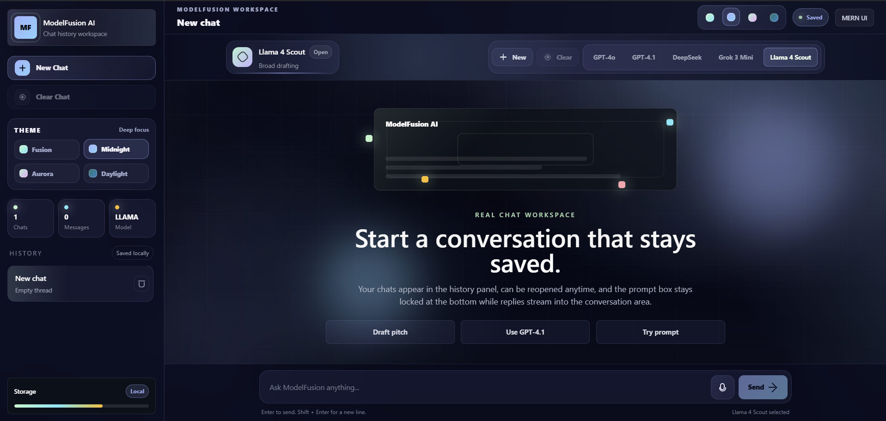

# 🚀 ModelFusion AI


**ModelFusion AI** is a modern multi-model AI chat platform that allows users to interact with multiple powerful AI models — including GPT-4o, GPT-4.1, DeepSeek, Grok, and Llama — all from a single interface.

> **One interface. Multiple AI minds.**

---

## 📸 Preview

> *(Add your screenshot here after uploading to GitHub)*

id="preview"



---

## ✨ Features

* 🧠 **Multi-Model Support**
  Switch between GPT-4o, GPT-4.1, DeepSeek, Grok, and Llama dynamically

* 💬 **Interactive Chat UI**
  Clean, responsive ChatGPT-style interface

* ⚡ **Real-Time AI Responses**
  Fast responses from multiple AI models via GitHub Models API

* 💾 **Chat Storage**
  Conversations stored in MongoDB

* 🔁 **Dynamic Model Switching**
  Backend intelligently routes requests to selected AI model

---

## 💡 Why ModelFusion AI?

This project demonstrates how to build a scalable **MERN stack application integrated with multiple AI models**, allowing seamless switching between different AI providers within a single interface.

---

## 🏗 Tech Stack

### Frontend

* React (Vite)
* Tailwind CSS
* Axios

### Backend

* Node.js
* Express.js
* MongoDB (Mongoose)

### AI Integration

* GitHub Models (OpenAI-compatible API)

---

## 📁 Project Structure

```id="structure"
model-fusion-ai/
│
├── backend/
│   ├── src/
│   │   ├── config/
│   │   ├── models/
│   │   ├── routes/
│   │   └── app.js
│
├── frontend/
│   ├── src/
│   │   ├── components/
│   │   ├── App.jsx
│   │   └── main.jsx
│
└── README.md
```

---

## ⚙️ Setup Instructions

### 🔧 Backend Setup

```bash id="backendsetup"
cd backend
npm install
```

Create a `.env` file inside `backend/`:

```id="env"
PORT=8080
MONGO_URI=mongodb://127.0.0.1:27017/modelfusion
GITHUB_TOKEN=your_github_token_here
```

Start backend server:

```bash id="runbackend"
npm run dev
```

Backend runs on:

```
http://localhost:8080
```

---

### 🎨 Frontend Setup

```bash id="frontendsetup"
cd frontend
npm install
npm run dev
```

Frontend runs on:

```
http://localhost:5173
```

---

## 🔌 API Endpoint

```
POST /api/chat
```

### Request Body:

```json id="request"
{
  "messages": [...],
  "model": "gpt | gpt41 | deepseek | grok | llama"
}
```

---

## 🔐 Environment Variables

| Variable     | Description                  |
| ------------ | ---------------------------- |
| GITHUB_TOKEN | GitHub Models API token      |
| MONGO_URI    | MongoDB connection string    |
| PORT         | Backend port (default: 8080) |

---

## 📌 Resume Highlights

* Built a full-stack MERN application with multi-model AI integration
* Implemented dynamic model switching (GPT, DeepSeek, Grok, Llama)
* Designed scalable backend architecture using Express & MongoDB
* Developed responsive frontend using React and Tailwind CSS

---

## ⚠️ Important Notes

* Never commit your `.env` file
* Ensure your GitHub token has `models:read` permission
* Some AI models may have rate limits on free tier

---

## 🚀 Future Improvements

* 🔐 User Authentication (JWT)
* 📜 Chat History Sidebar
* 🌐 Deployment (Vercel + Render)
* ⚡ Streaming Responses
* 🏷 Model badges in UI

---

## 🤝 Contributing

Contributions are welcome! Feel free to fork this repository and improve it.

---

## 📄 License

This project is licensed under the MIT License.

---

## ⭐ Support

If you found this project useful, consider giving it a ⭐ on GitHub!
