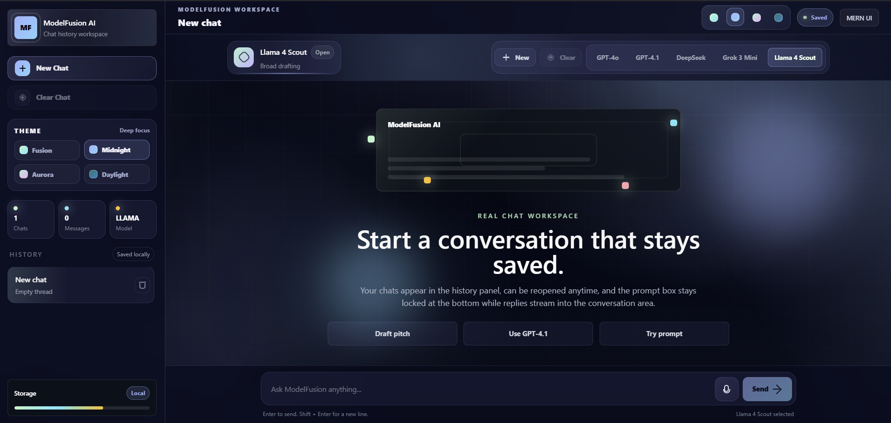

# ModelFusion AI

ModelFusion AI is a full-stack multi-model AI chat workspace built with React, Node.js, Express, MongoDB, and GitHub Models. It gives users one clean interface for switching between GPT-4o, GPT-4.1, DeepSeek, Grok, and Llama-style model routes while keeping conversations organized in a polished chat experience.

[](https://model-fusion-ai.vercel.app)
[](https://model-fusion-ai-2.onrender.com)
[](https://react.dev/)
[](https://nodejs.org/)
[](https://www.mongodb.com/)

## Live Project

**Public app:** [https://model-fusion-ai.vercel.app](https://model-fusion-ai.vercel.app)

**API health check:** [https://model-fusion-ai-2.onrender.com/api/health](https://model-fusion-ai-2.onrender.com/api/health)

> Note: the backend is hosted on Render's free tier, so the first request after inactivity can take a little longer while the service wakes up.

## Preview



## Highlights

- Multi-model chat interface with GPT-4o, GPT-4.1, DeepSeek, Grok, and Llama options
- Modern responsive React UI built for desktop and mobile use
- Local chat history workspace with saved conversations and model selection per thread
- Express API that securely keeps AI credentials on the server
- MongoDB-ready chat persistence through Mongoose
- Production deployment split across Vercel frontend and Render backend
- Environment-based configuration for safe local and cloud deployment

## Tech Stack

| Layer | Technology |
| --- | --- |
| Frontend | React, Vite, Tailwind CSS, Axios |
| Backend | Node.js, Express.js |
| Database | MongoDB, Mongoose |
| AI Gateway | GitHub Models API through the OpenAI-compatible SDK |
| Deployment | Vercel for frontend, Render for backend |

## Architecture

```text
Browser / Mobile
      |
      v
Vercel React Frontend
      |
      | POST /api/chat
      v
Render Express Backend
      |
      | GitHub Models API
      v
AI Model Response
      |
      v
MongoDB Chat Storage
```

## Project Structure

```text
model-fusion-ai/
├── backend/
│   ├── src/
│   │   ├── app.js
│   │   ├── config/db.js
│   │   ├── models/Chat.js
│   │   └── routes/chat.js
│   ├── .env.example
│   └── package.json
├── frontend/
│   ├── src/
│   │   ├── App.jsx
│   │   ├── main.jsx
│   │   └── components/
│   ├── vercel.json
│   └── package.json
├── screenshots/
├── render.yaml
└── README.md
```

## Local Development

Use Node.js `22.12.0` or any version satisfying `>=20.19.0`.

On Windows PowerShell, use `npm.cmd` if your execution policy blocks `npm`.

### Backend

```bash
cd backend
npm install
copy .env.example .env
npm run dev
```

Update `backend/.env`:

```env
PORT=8080
MONGO_URI=mongodb://127.0.0.1:27017/modelfusion
GITHUB_TOKEN=your_github_models_token_here
CLIENT_ORIGIN=http://localhost:5173
```

Backend health check:

```bash
curl http://localhost:8080/api/health
```

### Frontend

```bash
cd frontend
npm install
npm run dev
```

Open:

```text
http://localhost:5173
```

During local development, Vite proxies `/api` requests to `http://localhost:8080`.

## Environment Variables

### Backend

| Variable | Required | Description |
| --- | --- | --- |
| `GITHUB_TOKEN` | Yes | GitHub token with GitHub Models access |
| `MONGO_URI` | Optional | MongoDB connection string for saving chats |
| `CLIENT_ORIGIN` | Production | Public frontend URL allowed by CORS |
| `PORT` | Optional | Server port; Render provides this automatically |

### Frontend

| Variable | Required | Description |
| --- | --- | --- |
| `VITE_API_URL` | Production | Backend chat endpoint, for example `https://model-fusion-ai-2.onrender.com/api/chat` |

## Deployment

### Backend: Render

Create a Render Web Service using:

```text
Root Directory: backend
Build Command: npm install
Start Command: npm start
Health Check Path: /api/health
```

Render environment variables:

```env
NODE_VERSION=22.12.0
GITHUB_TOKEN=your_github_models_token_here
MONGO_URI=your_mongodb_atlas_connection_string
CLIENT_ORIGIN=https://model-fusion-ai.vercel.app
```

### Frontend: Vercel

Create a Vercel project using:

```text
Root Directory: frontend
Framework Preset: Vite
Install Command: npm install
Build Command: npm run build
Output Directory: dist
```

Vercel environment variable:

```env
VITE_API_URL=https://model-fusion-ai-2.onrender.com/api/chat
```

## Verification

```bash
cd backend
npm run check
```

```bash
cd frontend
npm run build
```

## Security Notes

- Keep `GITHUB_TOKEN` only on the backend.
- Never commit `.env` files.
- Use deployment environment variables for secrets.
- Restrict `CLIENT_ORIGIN` to trusted frontend domains in production.

## Author

Built by [Srujan-017](https://github.com/Srujan-017).

If this project is useful or interesting, consider visiting the GitHub profile and exploring more work:

[https://github.com/Srujan-017](https://github.com/Srujan-017)
